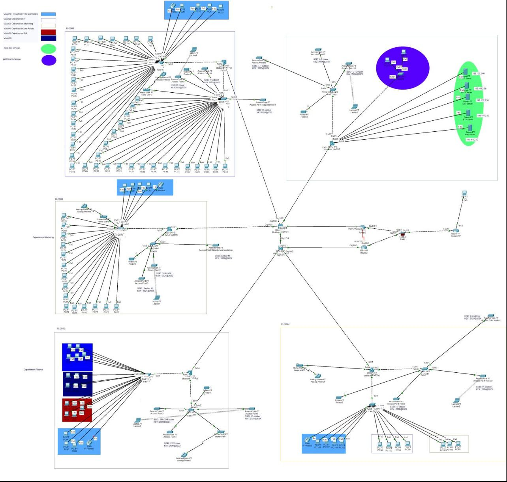

# 🏢 Enterprise Network Design & Security Project

> **Built by Ilyas Hodaiby** — A fully simulated secure enterprise network for a 100-user, five-floor organisation. Designed and implemented in Cisco Packet Tracer with a focus on segmentation, redundancy, security, and scalability.

---

## 📌 Overview

This project simulates the complete network infrastructure of a medium-sized enterprise — from physical floor layout to routing, switching, security, and internet access. Every design decision was made with real-world constraints in mind: department isolation, fault tolerance, efficient IP allocation, and secure traffic control.

The network supports **100 employees across 5 floors**, with each floor having its own technical room, wired and wireless connectivity, and dedicated VLAN segmentation per department.

---

## 🏗️ Network Architecture

```
                        ┌─────────────────────┐
                        │   ISP / Internet     │
                        └──────────┬──────────┘
                                   │
                        ┌──────────▼──────────┐
                        │   Edge Router        │
                        │   NAT/PAT · OSPF     │
                        │   ACLs · DHCP Server │
                        └──────────┬──────────┘
                                   │
              ┌────────────────────▼────────────────────┐
              │           Core Layer 3 Switch            │
              │     Inter-VLAN Routing · OSPF · STP      │
              │         HSRP Active (Priority 110)        │
              └───┬──────────────┬──────────────┬────────┘
                  │              │              │
         ┌────────▼───┐  ┌───────▼────┐  ┌────▼────────┐
         │ Floor 1     │  │ Floor 2-3  │  │ Floor 4-5   │
         │ Dist. Switch│  │ Dist.Switch│  │ Dist.Switch │
         └────────┬────┘  └─────┬──────┘  └──────┬──────┘
                  │             │                 │
            Access Switches · APs · Printers per floor
            (VLAN per department, trunk uplinks)
```

**Full topology diagram:** [`network-topology.png`](network-topology.png)

---

## 🧠 Design Decisions — Why I Made Each Choice

This section explains the reasoning behind each technical decision, not just what was implemented.

### VLANs — Department Segmentation

Each department is isolated in its own VLAN. This limits broadcast domains, improves performance, and — critically — means that if one department's machine is compromised, the attacker cannot reach other departments without going through a routed Layer 3 device where ACLs enforce access control.

| VLAN | Department | Subnet | Purpose |
|---|---|---|---|
| VLAN 10 | IT | 192.168.10.0/24 | Admin, servers, infrastructure |
| VLAN 20 | HR | 192.168.20.0/24 | HR systems — restricted from Finance |
| VLAN 30 | Finance | 192.168.30.0/24 | Sensitive — isolated from HR and general staff |
| VLAN 40 | Management | 192.168.40.0/24 | Executive floor |
| VLAN 50 | Guest / WiFi | 192.168.50.0/24 | Internet only — no internal access |

### OSPF — Dynamic Routing

OSPF was chosen over static routing because the network spans multiple Layer 3 devices across 5 floors. With static routes, any topology change requires manual updates on every device. OSPF propagates route changes automatically — if a link goes down, OSPF recalculates and reroutes traffic within seconds.

All internal subnets are advertised in **Area 0** (backbone area). This keeps the design simple while maintaining the scalability to add additional OSPF areas if the network grows.

### HSRP — Gateway Redundancy

Every VLAN gateway uses HSRP with two Layer 3 switches — one active (priority 110), one standby (priority 100). If the active switch fails, the standby takes over automatically. End devices always point to the **virtual IP** (e.g. 192.168.10.254) — they never notice the failover.

Without HSRP, a single switch failure would take down the internet access and inter-VLAN routing for every user on that switch. With HSRP, failover happens in under 10 seconds.

### ACLs — Traffic Control Between Departments

ACLs are applied at the Layer 3 switch (closest to the source) to enforce the principle of least privilege:

- **Finance VLAN** cannot be reached from HR or general staff VLANs
- **Guest VLAN** has no access to any internal subnet — internet only
- **IT VLAN** can reach all VLANs (admin access required)
- All inter-VLAN traffic not explicitly permitted is denied

### VLSM — Efficient IP Allocation

Using VLSM means each subnet is sized to exactly what the department needs — no wasted address space. A department with 20 users gets a /27 (30 usable hosts), not a full /24 (254 usable hosts).

### EtherChannel — Link Aggregation

Uplinks between access and distribution switches use EtherChannel (802.3ad LACP), bundling two physical links into one logical link. This doubles the bandwidth and provides redundancy — if one physical cable fails, traffic continues on the other with no reconfiguration needed.

---

## 🔐 Security Implementation

### Access Control Lists

```
Traffic policy enforced at Layer 3:

HR (VLAN 20)      ──X──►  Finance (VLAN 30)   BLOCKED
Finance (VLAN 30) ──X──►  HR (VLAN 20)         BLOCKED
Guest (VLAN 50)   ──X──►  All internal VLANs    BLOCKED
IT (VLAN 10)      ──✓──►  All VLANs             PERMITTED
All VLANs         ──✓──►  Internet (via NAT)     PERMITTED
```

### Port Security

Access switch ports are configured with port security:
- Maximum 2 MAC addresses per port
- Violation action: `shutdown` — port disabled on violation
- Prevents unauthorized devices from plugging in

### STP Security (BPDU Guard + Root Guard)

- **BPDU Guard** enabled on all access ports — prevents rogue switches from being connected and disrupting the spanning tree
- **Root Guard** enabled on distribution switch uplinks — ensures the designed root bridge is never overridden

### Management VLAN Isolation

Network devices (switches, routers) are managed only via VLAN 40 (Management). No end-user VLAN has SSH or Telnet access to infrastructure devices. SSH is enabled, Telnet is disabled on all devices.

---

## 📋 IP Addressing Scheme (VLSM)

| VLAN | Department | Network | Subnet Mask | Usable Range | Gateway | Hosts |
|---|---|---|---|---|---|---|
| 10 | IT | 192.168.10.0 | /24 | .1 — .254 | .254 (HSRP VIP) | 254 |
| 20 | HR | 192.168.20.0 | /24 | .1 — .254 | .254 (HSRP VIP) | 254 |
| 30 | Finance | 192.168.30.0 | /24 | .1 — .254 | .254 (HSRP VIP) | 254 |
| 40 | Management | 192.168.40.0 | /27 | .1 — .30 | .30 (HSRP VIP) | 30 |
| 50 | Guest/WiFi | 192.168.50.0 | /25 | .1 — .126 | .126 (HSRP VIP) | 126 |

DHCP pools are configured for VLANs 10, 20, 30, and 50. Static IPs are assigned to servers, printers, and APs.

---

## ⚙️ Configuration Reference

### OSPF — Dynamic Routing

```bash
router ospf 1
 network 192.168.10.0 0.0.0.255 area 0
 network 192.168.20.0 0.0.0.255 area 0
 network 192.168.30.0 0.0.0.255 area 0
 network 192.168.40.0 0.0.0.31 area 0
 network 192.168.50.0 0.0.0.127 area 0
 passive-interface default
 no passive-interface GigabitEthernet0/0
```

`passive-interface default` stops OSPF hello packets from being sent out user-facing ports — only router-to-router links participate in OSPF. This reduces unnecessary traffic and prevents OSPF manipulation from end devices.

### HSRP — Gateway Redundancy

```bash
! Active switch (priority 110 — wins the election)
interface Vlan10
 ip address 192.168.10.1 255.255.255.0
 standby 1 ip 192.168.10.254
 standby 1 priority 110
 standby 1 preempt

! Standby switch (priority 100 — takes over if active fails)
interface Vlan10
 ip address 192.168.10.2 255.255.255.0
 standby 1 ip 192.168.10.254
 standby 1 priority 100
 standby 1 preempt
```

End devices use `192.168.10.254` as their default gateway — always the same IP regardless of which physical switch is active.

### ACLs — Department Isolation

```bash
! Block HR from reaching Finance
access-list 110 deny   ip 192.168.20.0 0.0.0.255 192.168.30.0 0.0.0.255
! Block Finance from reaching HR
access-list 110 deny   ip 192.168.30.0 0.0.0.255 192.168.20.0 0.0.0.255
! Block Guest from all internal subnets
access-list 110 deny   ip 192.168.50.0 0.0.0.127 192.168.0.0 0.0.255.255
! Allow everything else
access-list 110 permit ip any any

! Apply to the inter-VLAN routing interface
interface Vlan20
 ip access-group 110 in
```

### DHCP — Automatic IP Assignment

```bash
! Reserve IPs for static devices (printers, APs, servers)
ip dhcp excluded-address 192.168.10.1 192.168.10.20
ip dhcp excluded-address 192.168.20.1 192.168.20.10

! DHCP pool for IT department
ip dhcp pool VLAN10-IT
 network 192.168.10.0 255.255.255.0
 default-router 192.168.10.254
 dns-server 8.8.8.8
 lease 1

! DHCP pool for HR department
ip dhcp pool VLAN20-HR
 network 192.168.20.0 255.255.255.0
 default-router 192.168.20.254
 dns-server 8.8.8.8
 lease 1
```

### NAT/PAT — Internet Access

```bash
! Define which traffic gets NATted
access-list 1 permit 192.168.10.0 0.0.0.255
access-list 1 permit 192.168.20.0 0.0.0.255
access-list 1 permit 192.168.30.0 0.0.0.255

! Apply NAT overload (PAT) on WAN interface
interface GigabitEthernet0/0
 ip nat inside
interface GigabitEthernet0/1
 ip nat outside
ip nat inside source list 1 interface GigabitEthernet0/1 overload
```

PAT maps all internal IPs to a single public IP using different source ports — a standard cost-effective approach for enterprise internet access.

### EtherChannel — Link Aggregation

```bash
! Bundle two physical links into one logical link (LACP mode)
interface range GigabitEthernet0/1 - 2
 channel-group 1 mode active
 channel-protocol lacp

interface Port-channel1
 switchport mode trunk
 switchport trunk allowed vlan 10,20,30,40,50
```

### Port Security — Access Ports

```bash
interface range FastEthernet0/1 - 24
 switchport mode access
 switchport port-security
 switchport port-security maximum 2
 switchport port-security violation shutdown
 switchport port-security mac-address sticky
 spanning-tree portfast
 spanning-tree bpduguard enable
```

`mac-address sticky` learns the first MAC address that connects and locks the port to it — no configuration file changes needed per device.

### SSH — Secure Management Access

```bash
! Disable Telnet, enable SSH only
hostname SW-FLOOR1
ip domain-name enterprise.local
crypto key generate rsa modulus 2048
ip ssh version 2

line vty 0 4
 transport input ssh
 login local
 exec-timeout 10 0

! Management access restricted to VLAN 40 only
access-list 99 permit 192.168.40.0 0.0.0.31
line vty 0 4
 access-class 99 in
```

---

## 🔍 Skills Demonstrated

**Network Design**
- Designed a multi-floor enterprise network from requirements to implementation
- Applied VLSM to allocate subnets efficiently based on department size
- Structured the topology in three layers: core, distribution, and access

**Routing & Switching**
- Configured OSPF for dynamic route propagation across multiple Layer 3 devices
- Implemented VLANs and 802.1Q trunking for department segmentation
- Used STP with PortFast and BPDU Guard to prevent instability on access ports
- Deployed EtherChannel (LACP) for link aggregation and redundancy

**High Availability**
- Configured HSRP on all VLAN gateways — failover under 10 seconds
- Designed EtherChannel uplinks so a single cable failure causes zero downtime

**Network Security**
- Applied ACLs enforcing least-privilege between all department VLANs
- Disabled Telnet, enforced SSH v2 with management VLAN restriction
- Configured port security with MAC sticky and auto-shutdown on violation
- Enabled BPDU Guard and Root Guard to protect spanning tree topology

**IP Services**
- Configured DHCP server with exclusions for static devices
- Implemented NAT/PAT for internet access from all internal VLANs

---

## 🖥️ Lab Environment

| Tool | Version | Purpose |
|---|---|---|
| Cisco Packet Tracer | 8.x | Network simulation |
| Cisco IOS | 15.x | Router and switch OS |

**Devices simulated:**
- 1× Edge router (Cisco 2911)
- 2× Core Layer 3 switches (Cisco 3650 — HSRP pair)
- 5× Distribution switches (one per floor)
- 10× Access switches (two per floor)
- 5× Wireless Access Points
- 5× Network printers
- ~100 end-user PCs

---

## 📂 Repository Structure

```
Enterprise-Network-Design-Security-Project/
│
├── README.md                        ← This file
├── network-topology.png             ← Full topology diagram
│
├── docs/
│   ├── topology.md                  ← Detailed topology breakdown per floor
│   ├── ip-addressing.md             ← Full IP addressing table
│   ├── vlan-design.md               ← VLAN design decisions
│   └── security-policy.md           ← ACL and security policy document
│
├── configs/
│   ├── edge-router.txt              ← Full router configuration
│   ├── core-switch-active.txt       ← Active core switch (HSRP primary)
│   ├── core-switch-standby.txt      ← Standby core switch (HSRP secondary)
│   ├── distribution-switch-floor1.txt
│   └── access-switch-floor1.txt
│
└── simulation/
    └── enterprise-network.pkt       ← Cisco Packet Tracer simulation file
```

---

## 📸 Network Topology



---

## 🧪 Testing & Validation

Each feature was validated in Packet Tracer simulation mode:

| Test | Method | Result |
|---|---|---|
| Inter-VLAN routing | Ping between VLANs | ✅ Pass |
| ACL enforcement | Ping HR → Finance | ✅ Blocked |
| OSPF convergence | Disconnect a link, check routing table | ✅ Reconverges |
| HSRP failover | Shutdown active switch, verify VIP stays reachable | ✅ Failover < 10s |
| DHCP assignment | Connect new PC, verify automatic IP | ✅ Pass |
| NAT/PAT | Ping 8.8.8.8 from internal hosts | ✅ Pass |
| EtherChannel | Shutdown one link in bundle, verify traffic continues | ✅ Pass |
| Port security | Connect third device to access port | ✅ Port shuts down |
| SSH access | SSH to device from VLAN 40 | ✅ Pass |
| SSH blocked | SSH attempt from VLAN 20 | ✅ Blocked by ACL 99 |

---

## 👤 About

**Ilyas Hodaiby** — MSc Computer Science, Ulster University London  
Aspiring SOC Analyst | Network Security | Threat Detection

[](https://linkedin.com/in/ilyas-hodaiby)
